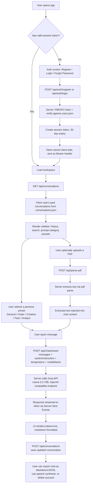
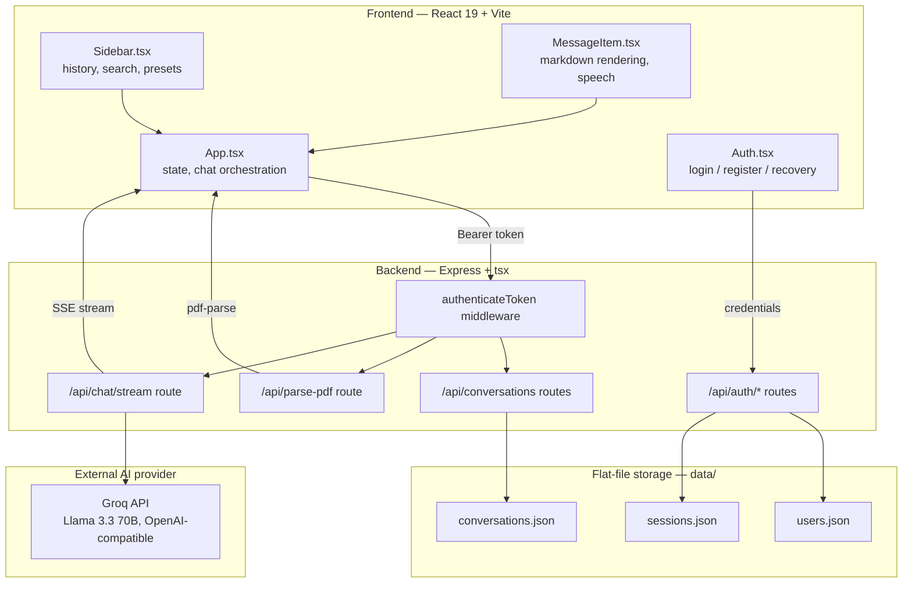

# Aether AI ChatBot  [](https://aether-ai-chatbot.onrender.com)


A sleek, modern, high-contrast workspace crafted in **React 19**, **Vite**, and **Express**, with beautiful fluid animations powered by **motion** (Framer Motion) and styled with the precision of **Tailwind CSS v4**. 

Aether serves as a secure, persistent conversational chatbot featuring private container-level memory, custom interactive prompts, multi-format exports, and real-time chat optimization utilities.

---

## 🎨 Design Philosophy & Features

Aether is designed with a striking **Cosmic Slate Theme** (deep slate blues, rich dark grays, and vivid pink/purple gradients) utilizing balanced negative space, responsive mobile-first views, and subtle micro-interactions to deliver a premium user experience.

### Key Capabilities

*   **🔐 Custom Authentication Gateway**: 
    *   Secure **Sign In** and **Create Space** registration form.
    *   Cryptographically-hashed passwords powered by `PBKDF2` (1000 iterations, 64-byte key length with secure random salting) stored on the container filesystem.
    *   30-day secure bearer token sessions stored locally and validated on each page refresh.
*   **💾 Infinite Memory & Persistent Storage**: 
    *   All chats, presets, and customized system parameters are synchronized to the server in real-time.
    *   Memory is persisted inside the container's disk (`data/conversations.json`), guaranteeing that user history remains intact **even after hard browser refreshes, cache clearances, or device switching**.
*   **📄 Seamless System Document Importer & PDF Q&A**:
    *   Direct system document imports supporting **PDF, TXT, MD, JSON, JS, TS, HTML, and CSS**.
    *   **Server-Side PDF Parsing Engine**: Leverages `pdf-parse` on Node.js to decode complex PDF file structures via an asynchronous base64 gateway.
    *   **Direct Client-Side Text Parsing**: Zero-overhead extraction for raw text files using HTML5 `FileReader` primitives.
    *   **Surgical Context Stuffing**: Injects parsed file contents as isolated references inside the prompt of the latest query, enabling the AI to answer deep, grounded questions about the uploaded document context.
*   **🗑️ Secure Chat Deletion**:
    *   Full administrative control with the option to instantly and permanently erase individual conversations from both the UI and the server's filesystem storage.
*   **⚡ Multiple Aether Core Models**: Configured to access highly optimized LLM backends tailored for different tasks:
    *   **Aether Large (Recommended)**: Best for complex reasoning and advanced debugging.
    *   **Aether MoE**: Highly responsive, balanced model for conversational tasks.
    *   **Aether Lite**: Fast and nimble for short questions.
    *   **Aether Legacy Models**: Backup architectures for standard queries.
*   **📚 Interactive Prompt Cards & Category Explorer**: Quick-start templates spanning multiple disciplines (Coding, Business/Copy, Creative Writing, Tutor/Coaching). Choose to **Draft** directly into your compose window for editing, or **Send** immediately.
*   **🔍 Real-Time Message Search**: Filter messages inside active conversations instantly with a lightweight, responsive in-chat filtering engine.
*   **🔊 Listen Aloud (Speech Synthesis)**: Integrated narration engine with markdown sanitization. Listen to answers read aloud dynamically with toggle, pulse animations, and automatic speech cancel/reset on unmount.
*   **📊 Conversation Analytics**: Deep visual insights panel tracking total messages, precise word and character counts, estimated reading times based on human-average speed (WPM), and average AI response lengths.
*   **💾 Multi-Format File Export**: Instantly export active conversation transcripts as beautifully formatted **Markdown (.md)** files or raw **JSON (.json)** for offline backups and records.

---

## System Workflow



### Workflow summary

1. **Authentication** — Custom PBKDF2-based auth (no third-party auth libraries). Sessions are random 32-byte tokens stored server-side with a 30-day expiry, validated on every protected route via an `authenticateToken` middleware.
2. **Persistence** — Users, sessions, and conversations are stored as flat JSON files (`data/users.json`, `sessions.json`, `conversations.json`), read and written through safe file I/O helpers — no external database required.
3. **Persona presets** — Five built-in system-prompt presets (General, Software Engineer, Creative Writer, Language Coach, Analyst & Summarizer) configure the system instruction and temperature before a chat starts.
4. **Document context** — Uploaded PDFs are parsed server-side with `pdf-parse`, and the extracted text is injected directly into the conversation context so the model can answer questions grounded in the document.
5. **Inference** — A single `/api/chat/stream` endpoint forwards the conversation to the Groq API (OpenAI-compatible chat completions, Llama 3.3 70B) and streams the response back to the client over Server-Sent Events.
6. **Session lifecycle** — Conversations are saved back to disk after each exchange, can be exported (Markdown/JSON), read aloud via speech synthesis, and a user can fully purge their account (users, sessions, conversations) in one action.

## Architecture



## Tech Stack

| Layer | Technology |
|---|---|
| Frontend framework | React 19, Vite 6 |
| Styling | Tailwind CSS 4 |
| Icons / animation | lucide-react, motion |
| Markdown rendering | react-markdown |
| Backend | Express 4, tsx (TypeScript runtime) |
| LLM provider | Groq API (Llama 3.3 70B, OpenAI-compatible chat completions) |
| PDF parsing | pdf-parse |
| Auth | Custom PBKDF2 password hashing + token-based sessions (no external auth library) |
| Data storage | Flat JSON files (`data/users.json`, `sessions.json`, `conversations.json`) |
| Build | Vite (frontend) + esbuild (server bundle) |

---

## 🚀 Getting Started

### Prerequisites

*   Node.js (v18 or higher recommended)
*   npm or yarn

### Installation

1. Clone the repository:
   ```bash
   git clone <your-repository-url>
   cd aether-workspace
   ```

2. Install dependencies:
   ```bash
   npm install
   ```

3. Set up your environment variables. Copy the `.env.example` file and configure your API keys:
   ```bash
   cp .env.example .env
   ```
   Configure the keys in `.env`:
   ```env
   GROQ_API_KEY="your_groq_api_key_here"
   GEMINI_API_KEY="your_gemini_api_key_here"
   ```

### Running the Application

*   **Development Mode**: Bootstraps the full-stack system with hot server reloading via `tsx`:
    ```bash
    npm run dev
    ```
    The server will boot up and serve the application on [http://localhost:3000](http://localhost:3000).

*   **Production Build**: Compiles frontend assets into `dist/` and bundles the Express server using `esbuild` into a CJS-safe, self-contained standalone server (`dist/server.cjs`):
    ```bash
    npm run build
    ```

*   **Production Start**: Launches the compiled bundle:
    ```bash
    npm run start
    ```

*   **Linter check**:
    ```bash
    npm run lint
    ```

---

## 📂 Project Architecture

```txt
├── server.ts             # Express server handling PBKDF2 cryptography, session states, and proxy routes
├── index.html            # Primary single-page entry point
├── package.json          # Dependency definitions and build pipeline scripts
├── tsconfig.json         # TypeScript configuration
├── data/                 # Container-bound local database filesystem (Git ignored)
│   ├── users.json        # Encrypted user records & salts
│   ├── sessions.json     # Active logged-in session tokens
│   └── conversations.json# Persistent conversation histories organized by username
├── src/
│   ├── main.tsx          # React application bootstrapping entry point
│   ├── App.tsx           # Primary application logic, state managers, and core view
│   ├── types.ts          # Strongly-typed interface and object descriptions
│   ├── presets.ts        # Modular configuration presets for AI Personas
│   ├── index.css         # Tailwind v4 directives and theme variables
│   └── components/
│       ├── Auth.tsx      # Secure custom credentials login & registration panel
│       ├── Sidebar.tsx   # Panel containing chat lists, insights, settings, & exports
│       └── MessageItem.tsx # Chat bubble with copy, speech synthesis, and formatting
```

---

## 🔒 Security

All API keys are secured server-side. The client application never exposes secret credentials or API headers directly to the browser. Communication with AI backends is proxied securely through server routes in `server.ts`. 

In addition, user passwords are cryptographically salted and hashed using standard Node.js crypto primitives (`pbkdf2Sync` with 1000 iterations), ensuring robust workspace privacy.
